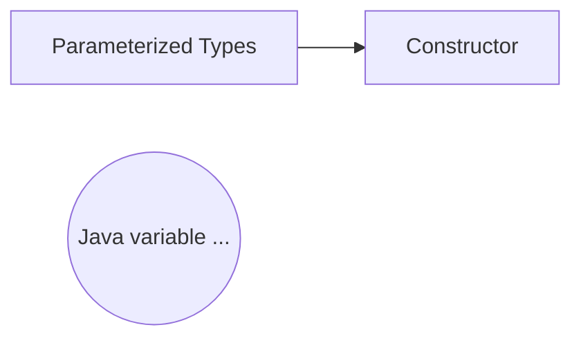
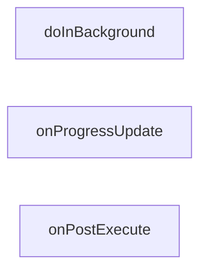
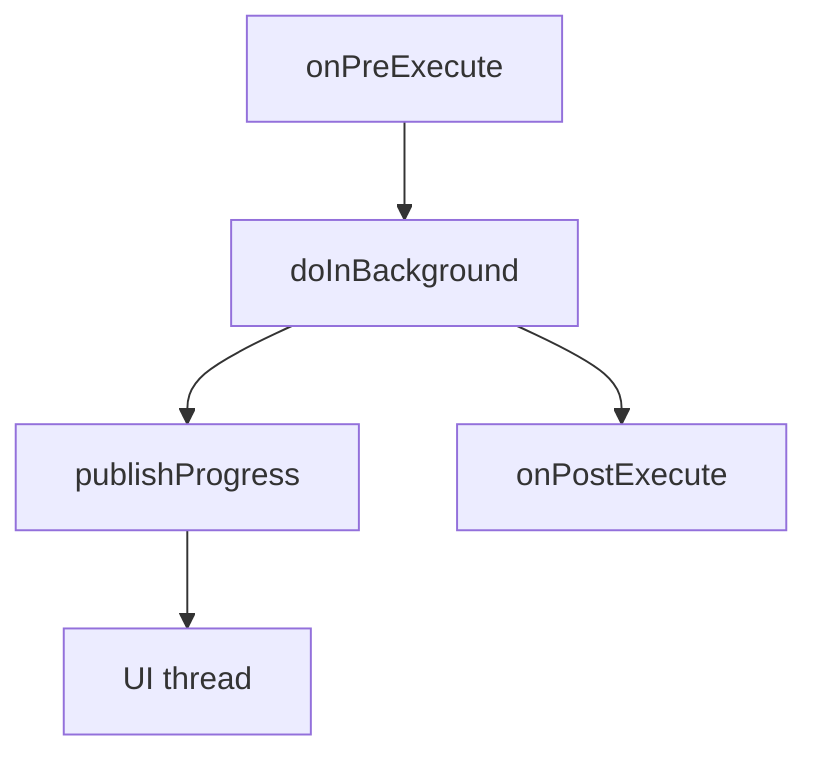

# AsyncTask
AsyncTask is a generic class, meaning that it takes parameterized types in its constructor.

Each one of these generic parameters is to find as a Java variable argument with the three dots.
Which means that it is technically passed as an array in Java World.
### Three types
The three types used by an AsyncTask are the following:

> **Params**, parameter type sent to the task upon execution.

> **Progress**, type published to update progress during the background computation.

> **Result**, the type of the result of the background computation.

These three parameters correspond to three primary functions you can override in AsyncTask.

There is also an onPreExecute function to help complete the pattern.

### Execute AsyncTask
You call **Execute** with the parameters to be set to the background task.

### Implement AsyncTask
The first to-do is to make an AsyncTask inside of the MainActicity.
```java
import android.os.AsyncTask;

public class MainActivity extends AppCompatActivity {
	private TextView mWeatherTextView;
	
    @Override
    protected void onCreate(Bundle savedInstanceState) {
        super.onCreate(savedInstanceState);
        setContentView(R.layout.activity_layout);
		mWeatherTextView = (TextView) findViewById(R.id.tv_weather_data);
        
        runAsyncTask();
    }

	private void runAsyncTask() {
		new myAsyncTask.execute("my localtion for weather data")
	}
	
	public class myAsyncTask extends AsyncTask<String, Void, String[]> {
		@Override
		protected String doInBackground(URL... params) {
            if (params.length == 0) {
                return null;
            }

            String location = params[0];
            URL weatherRequestUrl = NetworkUtils.buildUrl(location);

            try {
                String jsonWeatherResponse = NetworkUtils
                        .getResponseFromHttpUrl(weatherRequestUrl);

                String[] simpleJsonWeatherData = OpenWeatherJsonUtils
                        .getSimpleWeatherStringsFromJson(MainActivity.this, jsonWeatherResponse);

                return simpleJsonWeatherData;

            } catch (Exception e) {
                e.printStackTrace();
                return null;
            }
		}
		
		@Override
		protected void onPostExecute(String[] weatherData) {
            if (weatherData != null) {
                for (String weatherString : weatherData) {
	                // updates the TextView in the activity_layout
                    mWeatherTextView.append((weatherString) + "\n\n\n");
                }
            }
		}
	}


	
}
```
